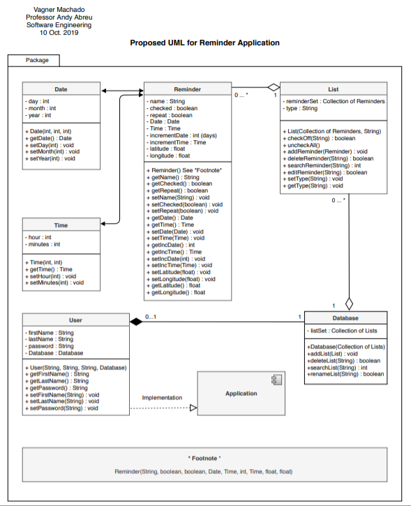
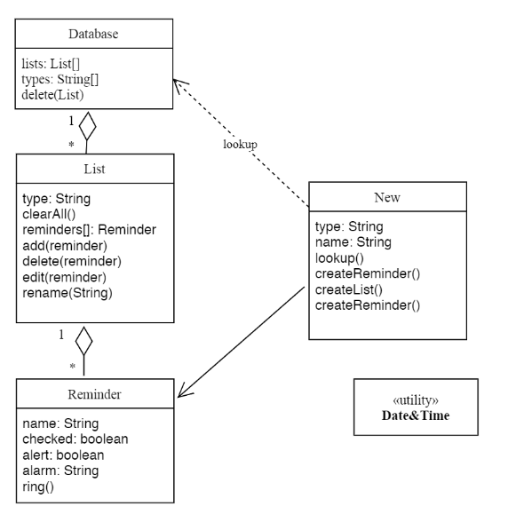
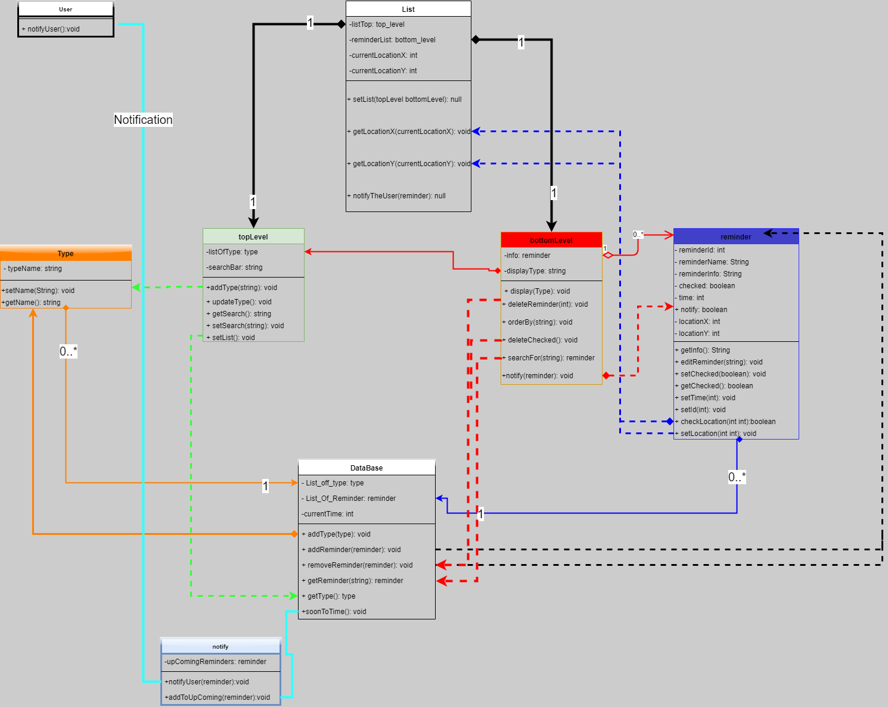
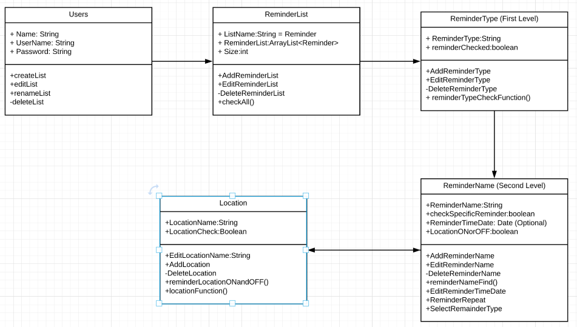
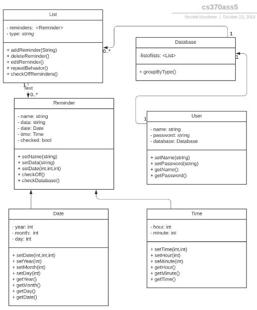
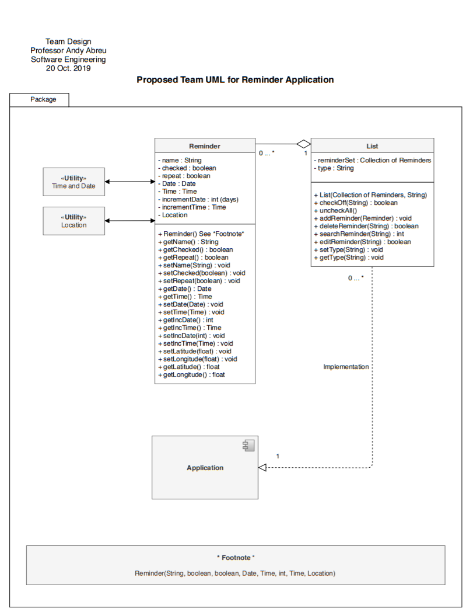

# Individual Designs

## ***Design 1*** ##
  
**PROS**   
(Vagner)  
(Ken) Well organized and shows how concepts will interact in a easy to read left to right manner  
(Amin) Very detailed in presenting all methods  
(Pizon) Very extensive and thoughtout and looks like it will be easily be able to decide how to control different aspects of the app    
(Yechiel)   

**CONS**  
(Vagner) After discussion in class, I realized that the *Database* class does not need to be represented in the UML as it is an external resource. Additonally, data related to reminders based on location might need to be added now as it is not part of the core set of requirements    
(Ken)Footnote not really needed to convey idea in this display (Footnote is the constructor for Reminder class which did not fit in design)    
(Amin) User class is not needed, this was not a requirement  
(Pizon) I am afraid there are soo many variables and instances that it might be difficult to implement every aspect    
(Yechiel)   

---   

## ***Design 2*** ##  
  
**PROS**  
(Vagner) Concise design, added the method ring(), an idea that may be useful to display notifications     
(Ken) Having a isolated utility class could be later expanded on and help in troubleshooting Date&time  
(Amin) Nice and simple, making it very manaegable    
(Pizon) Design is simple and might allow us to implement it with little difficulty  
(Yechiel)   

**CONS**  
(Vagner) Data types can be added in order to better visualize the UML. Database does not need to be represented as said in class   
(Ken) Naming convention on the "New" node doesnt really convey its purpose in the UML   
(Amin) relationships between classes could be unclear or weak    
(Pizon) There might a lot of side exceptions where the implementation might not workout as theoretically as it is designed.   
(Yechiel)   

--- 

## ***Design 3*** ## 

**PROS**     
(Vagner) Displays class connections and action relationships, shows the data types   
(Ken)   
(Amin) very detailed in relationships between classes   
(Pizon) Great design and the relationships between classes strong    
(Yechiel)   

**CONS**  
(Vagner) I believe that just one connection between classes would suffice otherwise seems too intricate   
(Ken) Database class is not needed, to many connections that intercept each other makes it difficult to read fluently  
(Amin) Overcomplicated the required classes; perhaps you were thinking of interface when making top and bottom level  
(Pizon) Looks a little too complicated to implement where it would very time consuming   
(Yechiel)   

---  

## ***Design 4*** ##  
  
**PROS**     
(Vagner) Sequential design is somethin akin to a flow graph that demonstrates sequence of actions     
(Ken) Sequential ordering of the classes shows the flow and interaction of data between classes   
(Amin) Having reminder spilt into ReminderType and ReminderName reduces a logical problem we might run into   
(Pizon) Nothing     
(Yechiel)   

**CONS**  
(Vagner)  ReminderType and ReminderName seem like the same thing split into two classes yet one is not in other instance data.  
Missing composition and aggregation arrows    
(Ken)Does not show any methods to actually saving data    
(Amin) User class was not required  
(Pizon) Doesn't look like much time was put into it    
(Yechiel)   

---  

## ***Design 5*** ##  
  
**PROS**     
(Vagner)       
(Ken)     
(Amin) A list of all the lists does need to be stored somewhere    
(Pizon)  
(Yechiel)   

**CONS**  
(Vagner)       
(Ken)     
(Amin) Date is a utility    
(Pizon)      
(Yechiel)   

---  

# Team Design    
   

**These are the changes we added or removed to the team design**     
*1* Removed the database class since it is an external resource   
*2* Removed the Time and Location classes and added Time and Location Utility classes     
*3* Removed the user class    
  

### Summary    
 We went through our data and picked the best features of each individual design and removed features that were not in the requirement. The result is the redrawn design displayed above.
