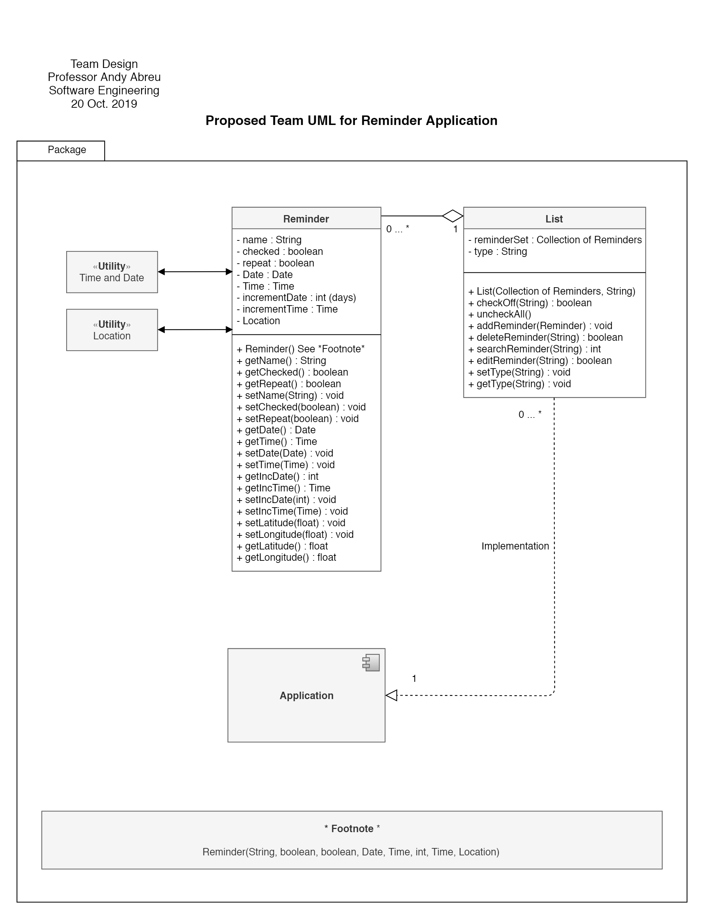
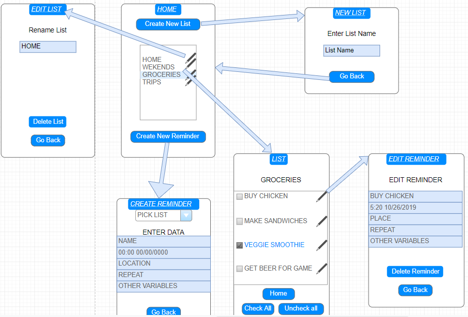
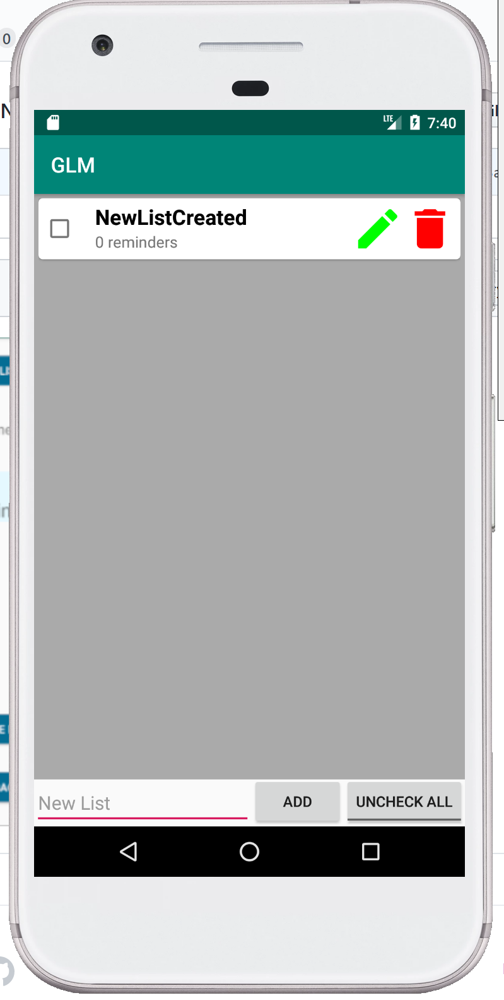

# Design Document
**Author**: Kenley Nicolas (Team5a)

## 1 Design Considerations 
 Consideration for the design include how to properly implement the management of data being stored and retrieved and what data structure allows for the best use case in our app implementation. Certain data structures might hinder the retrieval of data or deletion of data as it might be difficult to have the front and back-end to cooperate, for instances using an icon to delete a list and all of its contents might theoretically be simply done visually but properly to implement might be difficult in the backend.

### 1.1 Assumptions
Operational Environment: Adroid Studio  

Assumption: app will be constructed in API 21 or later
  All reminders should be connected to the list it originated from vice-versa all list should be connected to the reminders it created
  
Dependencies: SQL LITE for database  

### 1.2 Constraints

API Level  
Android Operating System  

### 1.3 System Environment

Software must operate on Android.  

## 2 Architectural Design

### 2.1 Component Diagram

App uses a UI to simply interact with the user and androids build in database to return values.

### 2.2 Deployment Diagram

Only piece of actual hardware in use is the database and built in android functions.

## 3 Low-Level Design

### 3.1 Class Diagram

### 3.2 Other Diagrams

## 4 User Interface Design

