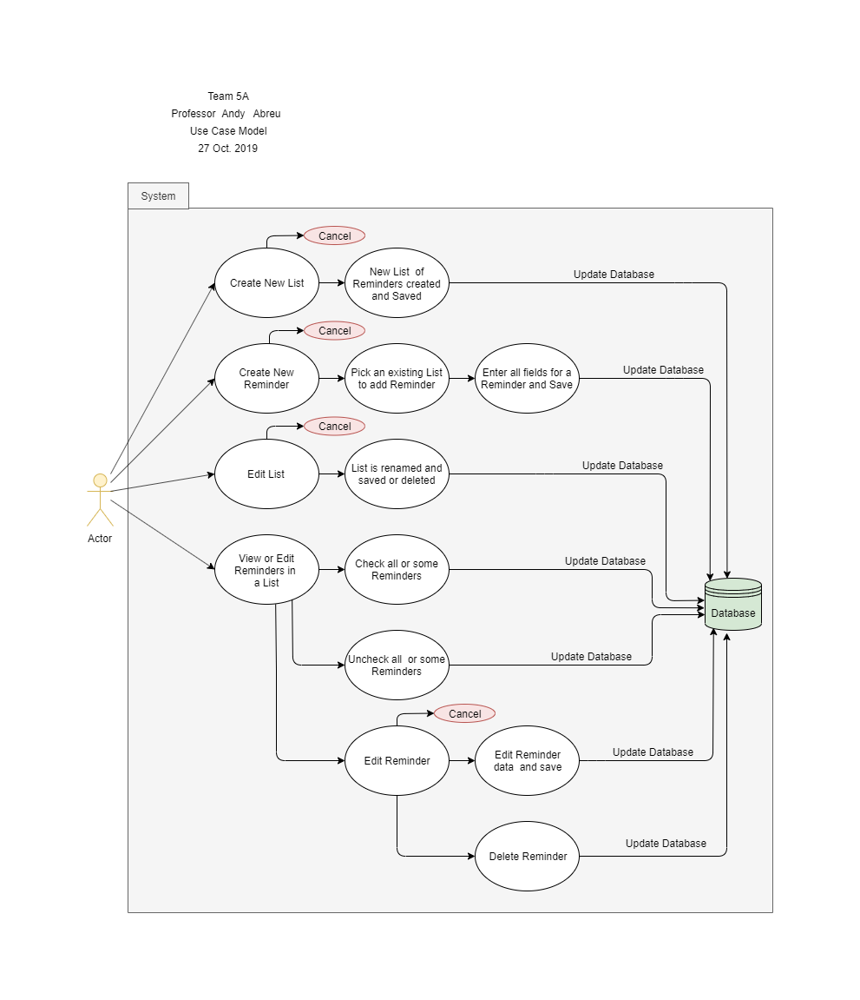

  
# Use Case Model 
 

---  

&nbsp;&nbsp;&nbsp;&nbsp;&nbsp;&nbsp;&nbsp;&nbsp;&nbsp;The objective of the Use Case Model diagram is to demonstrate how a user can interact with the Reminder Application being developed, given current specifications. As new information is made available or upon requirement changes, this model can change.  The lines starting at the actor depict the interactions it can have with the application interface.   

---   

<b>Author: <i>Vagner Machado</i></b>  
  

---   

## 1 - Use Case Diagram   

  

---    

## 2 - Use Case Descriptions   

&nbsp;&nbsp;&nbsp;&nbsp;&nbsp;&nbsp;&nbsp;&nbsp;&nbsp;The proposed diagram shows that the actor can have four main interaction with the application. The actor can **Create a New List**, **Create a New Reminder**, **Edit a List** and **View and Edit with Reminders in a List**. It is worth noting that upon choosing one of the options, the diagram shows the user can perform fruther actions related to the choice made or cancel intended interactions. For each of the Use Cases, we further explore the needed *Requirements*, *Pre-Conditions*, *Post-Conditions* and *Scenarios* for such actions.    

--- 

#### Use Case 1: Create a New List  
- *Requirements*   
This user case must allow the user to interact with the application interface and create a custom named List.     

- *Pre-conditions*   
The appllication must be running properly, with previoulsy created lists and reminders properly populated. The application must be displaying the *HOME* activity in order to initiate this use case.    

- *Post-conditions*  
The application will be displaying a newly custom named List in the *HOME* activity. 

- *Scenarios*   
  - Normal: The user wishes to create a new List to store Reminders. The user clicks on *Create New List* and the application transitions to *NEW LIST* activity. At this point, the user enters the name for the new List and clicks on the *Go Back* button. The application creates the new List, updates the database and transitions back to the *HOME* activity.    
  - Alternate: The user wishes to create a new List to store Reminders. The user clicks on *Create New List* and the application transitions to *NEW LIST* activity. At this point, the user enters the name for the new List but realized the he/she either does not need a new List ot that the List already exists. The user then clicks on *Cancel* and application transitions back to *HOME* activity.    
  - Exceptional: The user wishes to create a new List to store Reminders. The user clicks on *Create New List* and the application transitions to *NEW LIST* activity. At this point, the user enters the name for the new List clicks on *Go Back* without realizing that the List name already exists. The application warns the user that the List already exists and transitions back to *HOME* activity without making any changes.   

---  

#### Use Case 2: Create a New Reminder
- *Requirements*   
This user case must allow the user to interact with the application interface to create a custom Reminder.

- *Pre-conditions*   
The application must be running properly, with previoulsy created lists and reminders properly populated. The application must be displaying the *HOME* activity in order to initiate this use case.    

- *Post-conditions*  
The application will have stored a new Reminder under a chosen existing List and will be displaying the *HOME* activity.   
 

- *Scenarios:*  
  - Normal: The user wishes to create a new Reminder inside a List. The user clicks on *Create New Reminder* button and application trasitions to *CREATE REMINDER* activity. The user picks a List that must have the Reminder, enters all the information for the new Reminder and clicks on *Go Back*. The application updates the database and transitions back to the *HOME* activity.   
  - Alternate: The user wishes to create a new Reminder inside a List. The user clicks on *Create New Reminder* button and application trasitions to *CREATE REMINDER* activity. The user picks a List that must have the Reminder, enters all the information for the new Reminder but realizes that the Reminder is either not needed or already exists. The user clicks on *Cancel* and application transitions back to *HOME* activity.   
  - Exceptional: The user wishes to create a new Reminder inside a List. The user clicks on *Create New Reminder* button and application trasitions to *CREATE REMINDER* activity. The user picks a List that must have the Reminder, enters all the information for the new Reminder and clicks on *Go Back*. However, the user did not realize that a Reminder with that same name already exists. The application warns the user that the Reminder already exists and transitions back to *HOME* activity without making any changes.       

---  

#### Use Case 3: Edit List
- *Requirements*   
This user case must allow the user to interact with the application interface to edit an existing List.

- *Pre-conditions*   
The application must be running properly, with previoulsy created lists and reminders properly populated. The application must be displaying the *HOME* activity in order to initiate this use case.    

- *Post-conditions*  
The application will have updated and stored the renamed List or have deleted a List. After either action, it will be displaying the *HOME* activity.   
  
- *Scenarios:* 
  - Normal: The user wishes to edit the name of a List. The user clicks on *Edit* icon next to a List and application transitions to *EDIT LIST* activity. User enters an updated, new and unique name for the List and clicks on *Go Back*. The application updates the database and transitions to *HOME* activity.    
  - Alternate 1: The user wishes to delete an existing List. The user clicks on *Edit* icon next to a List and application transitions to *EDIT LIST* activity. The user clicks on *Delete List*, the application updates the database and transitions to *HOME* activity.     
  - Alternate 2: The user wishes to delete an existing List or edit a List name. The user clicks on *Edit* icon next to a List and application transitions to *EDIT LIST* activity.  The user realizes that he/she has changed his/her mind about the changes to the List. The user clicks on *Cancel* and application transitions to *HOME* activity.    
  - Exceptional: The user wishes to edit the name of a List. The user clicks on *Edit* icon next to a List and application transitions to *EDIT LIST* activity. User enters a updated name for the List and clicks on *Go Back*. The user does not realize that a List with same as new name already exists. The application warns the user and transitions to *HOME* activity without making any changes.      

---  

#### Use Case 4: View or Edit with Reminders 
- *Requirements*   
This user case must allow the user to interact with the application interface to view a List of Reminders and to interact with each individual Reminder. The interactions should allow the user to check and uncheck individual Reminders or the whole List, and edit or delete Reminders.   

- *Pre-conditions*   
The application must be running properly, with previoulsy created lists and reminders properly populated. The application must be displaying the *HOME* activity in order to initiate this use case.    

- *Post-conditions*  
The application will have updated the database to reflect the interaction with the user and displaying the *List* activity with chosen List of Reminders on display. 
  
- *Scenarios:* 
  - Normal: The user wishes to see all the Reminders saved under a List. The user clicks on List name and application transitions to *List* activity. The user views Reminders, checks and/or unchecks Reminders as needed and then clicks on *Home*. The application updates the database to reflect possible changes and transitions back to *HOME* activity.   
  - Alternate 1:  The user wishes to delete a Reminder. The user clicks on List name and application transitions to *LIST* activity. The user click on *Edit* next to Reminder to be deleted and application transitions to *Edit Reminder* activity. The user finally clicks on *Delete Reminder*, the application updates the database and transitions back to *List* activity.
  - Alternate 2:  The user wishes to edit a Reminder. The user clicks on List name and application transitions to *LIST* activity. The user click on *Edit* next to Reminder to be edited and application transitions to *Edit Reminder* activity. The user enters updated information for the Reminder and clicks on *Go Back*. The application updates the database and transitions back to *List* activity.
  - Alternate 3:  The user wishes to edit or delete a Reminder. The user clicks on List name and application transitions to *LIST* activity. The user click on *Edit* next to Reminder to be deleted or edited and application transitions to *Edit Reminder* activity. Upon viewing the Reminder information, the user decides not to change it. He/she clicks on *Cancel* and transitions back to *List* activity without making any changes.
  - Exceptional:  The user wishes to edit a Reminder. The user clicks on List name and application transitions to *LIST* activity. The user click on *Edit* next to Reminder to be edited and application transitions to *Edit Reminder* activity. The user enters updated information for the Reminder and clicks on *Go Back*. The user does not realize that a Reminder with same name already existed, so the application warns the user and transitions back to *List* activity without making any changes to database.

---  

<u>** The Use Case Model reflects requiriments as of 10/27/2019 **</u>

---  
